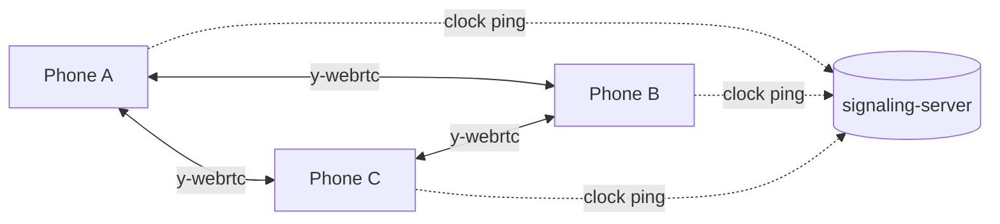

# mesh-pair-rotation

[](https://baditaflorin.github.io/mesh-pair-rotation/)
[](https://github.com/baditaflorin/mesh-pair-rotation/blob/main/package.json)
[](LICENSE)
[](docs/adr/0001-deployment-mode.md)

> Peer-to-peer mesh: pair-programming rotation manager. Suggest fresh pairs by weighted-greedy matching, sync driver-navigator role flip every 25 min across both phones in each pair.

**Live:** https://baditaflorin.github.io/mesh-pair-rotation/

A small team app for organizing pair-programming sprints. Add yourself
to the roster, tap **Suggest pairs**, and the matcher proposes a fresh
set based on per-pair history (older pairings get prioritized to break
cliques). Lock pairs that should stick; confirm to start the sprint.

Once a sprint is active, every phone in a pair displays "you are
DRIVING" or "you are NAVIGATING" with a countdown to the next flip.
When the timer hits zero, both phones vibrate and beep. Sprint state
is mesh-time-synced — a phone joining mid-sprint shows the same role
and the same remaining-to-flip time as everyone else.

## How it works

1. Phones share a **Yjs document** over **y-webrtc**.
2. The roster is `Y.Array<string>`; history is `Y.Map<pairKey,
{ lastPaired }>` keyed by sorted-names-joined-by-`::`.
3. **Suggest pairs** runs a weighted-greedy match: candidate pairs are
   scored by `now - lastPaired` (never-paired = `+∞`), sorted desc with
   a deterministic tie-break, and matched greedily.
4. **Confirm and start sprint** writes the sprint record into
   `Y.Map<sprintId, Sprint>("sprints")` and updates `history` for every
   new pair, all in one Yjs transaction.
5. **Role flip** is `Math.floor((meshNow - sprint.startedAt) /
flipIntervalMs) % 2`. Both phones in a pair compute identically;
   when the value changes, they vibrate.

## Privacy threat model

See [docs/privacy.md](docs/privacy.md). Cards have no message content —
just names and pair timestamps.

## Architecture

- **Mode A** — pure GitHub Pages.
- **WebRTC** — Yjs + y-webrtc with self-hosted signaling and TURN.
- **Clock sync** — median-offset mesh-time, drives role-flip detection.



## Run it locally

```bash
git clone https://github.com/baditaflorin/mesh-pair-rotation.git
cd mesh-pair-rotation
npm install
npm run dev
```

## Build for Pages

```bash
npm run build
npm run pages-preview
```

The `docs/` output is committed to the repo. Pages serves from `main`,
`/docs`.

## Self-hosted infrastructure

| Repo                                                                   | Endpoint                               | Role                        |
| ---------------------------------------------------------------------- | -------------------------------------- | --------------------------- |
| [signaling-server](https://github.com/baditaflorin/signaling-server)   | `wss://turn.0docker.com/ws`            | y-webrtc protocol fan-out   |
| [turn-token-server](https://github.com/baditaflorin/turn-token-server) | `https://turn.0docker.com/credentials` | HMAC TURN creds, 1-hour TTL |
| [coturn-hetzner](https://github.com/baditaflorin/coturn-hetzner)       | `turn:turn.0docker.com:3479`           | TURN relay                  |

Override from the in-app Settings drawer.

## Settings (in-app)

- **Room ID**
- **Your name** — appears in the roster
- **Flip interval (minutes)** — default 25
- **Lookback (weeks)** — soft hint to the matcher
- **Signaling / TURN URLs** — overrides

## ADRs

- [0001 — Deployment mode](docs/adr/0001-deployment-mode.md)
- [0002 — Weighted greedy matching, role-flip mesh-time](docs/adr/0002-weighted-greedy-matching.md)
- [0003 — Sprint as the period](docs/adr/0003-sprint-as-period.md)
- [0010 — GitHub Pages publishing](docs/adr/0010-pages-publishing.md)

## License

[MIT](LICENSE) © 2026 Florin Badita
